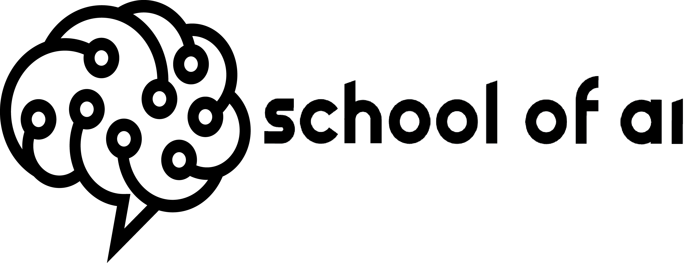

#  [School of AI ](https://www.theschool.ai)

## Introductory meet-up 

This section consists of the list of resources used in the introductory meet-up held on 22nd of September, 2018. 

###  Speakers

* [Jubeen Shah](http://linkedin.com/in/jubeen-shah) — Dean at school of AI in Raleigh
* [Brandon Johnson](https://www.linkedin.com/in/bjohn5on) — Solutions Engineer at NetApp and CEO of Koanologies
* [David Ellison](https://www.linkedin.com/in/ellisondavid) — Senior Artificial Intelligence Data scientist at Lenovo
* [Tao Wang](https://www.linkedin.com/in/tao-wang-9b2a5316) — Sr. Manager at Artificial intelligence and machine learning R&D decision at SAS

###  Presentations
* List of presentation links will be updated after the meetup 

###  Links 
* Want to learn about markdown. Visit [this](https://daringfireball.net/projects/markdown/basics) site for information regarding formatting your Jupiter notebooks. 

###  Code and demos

* Neural net in 11 lines **adding the link**
	* Reference to [Andrew Trask](https://iamtrask.github.io/2015/07/12/basic-python-network/)
* [Deep traffic ](https://selfdrivingcars.mit.edu/deeptraffic/)
	* [What is it about](https://selfdrivingcars.mit.edu/deeptraffic-about/)
* [AI Flappy bird](https://github.com/yenchenlin/DeepLearningFlappyBird)
	* Please note that you need to have anaconda installed on your PC for easy installation of dependencies. 
		* **It is perfectly fine if you don’t understand what is going on**
        
###  Tools 
* Anaconda (Version >5.0, python version 3.x)
	* **About**
		* Anaconda is a distribution of packages built for data science. 
		* It comes with conda, a package and environment manager. 
		* You can use conda to create environments for isolating your projects that use different versions of Python and/or different packages.
	* **Installation**
		* [For Windows](https://www.anaconda.com/download/#windows)
		* [For MacOS](https://www.anaconda.com/download/#macos)
		* [For Linux](https://www.anaconda.com/download/#linux)
	* Click [here](https://docs.anaconda.com/anaconda/) if you’re interested in the documentation
	* To understand how to use anaconda please visit this [site](https://docs.anaconda.com/anaconda/navigator/k)
	* For environment creation and management please go through [this link](https://conda.io/docs/user-guide/tasks/manage-environments.html). Get a gist of the basics required for installation and management of environments. 
		* If you prefer videos. [This](https://youtu.be/EGaw6VXV3GI) provides a very good summary for you to follow. 
* [Jupiter Notebooks](http://jupyter.org/)
	* This is a very interactive tool of learning and teaching python programming. 
	* Good thing is, it comes preinstalled with anaconda. So you don’t have to install anything else. 
	* [Example](https://github.com/jubeenshah/tensorflow-projects/blob/master/04_Uda/02_ConvolutionalNeuralNetworks/07_ConvolutionalNetworks/06_ConvolutionalNetworkInTensorFlow/06_Convolutional-Network-in-TensorFlow.ipynb)
		* Want to learn about markdown. Visit [this](https://daringfireball.net/projects/markdown/basics) site for information regarding formatting your Jupiter notebooks.
			* There are some [magic keywords](http://ipython.readthedocs.io/en/stable/interactive/magics.html) for you to use in the notebooks. I’ll leave it for you to explore. 

###  Additional reading before next meet-up 

* Read the part 1 of the deep learning book found [here](http://www.deeplearningbook.org/)
	* It will give you a brief idea about the math and machine learning concepts to get started with deep learning and being comfortable with it. 
* You should use [this](https://www.flickr.com/photos/95869671@N08/40544016221) cheat sheet for understanding any math notation. 
* If you’re uncomfortable with python programming I would recommend [this course](https://www.udacity.com/course/programming-foundations-with-python—ud036) to get you started with python. 
* Interested in deep learning and machine learning? [Sci-kit learn is your go to library ](http://scikit-learn.org/)
* I recommend you to read up a bit on [Perceptrons](https://en.wikipedia.org/wiki/Perceptron)
	* These are the simplest forms of neural networks out there 
* Lets *ascent* the mountain of AI space with [gradient descent](https://en.wikipedia.org/wiki/Gradient_descent)... ¡wait what!
	* A process by which Machine Learning algorithms learn to improve themselves based on the accuracy of their predictions
* [Backpropogation](http://neuralnetworksanddeeplearning.com/chap2.html) 
	* The process by which neural networks learn how to improve individual parameters. 
* Need a library for scientific computing? [Numpy](http://www.numpy.org/) has you covered. 
* [Tensorflow](http://tensorflow.org/) we’ll get there. 

If nothing go through athese web pages. And make sure you bookmark them for easy access. 

###  Courses 

* [Python course](https://www.udacity.com/course/programming-foundations-with-python—ud036) 
* [Numpy, pandas, matplotlib](https://www.udacity.com/course/intro-to-data-analysis—ud170) 

###  Books 
* [Deep learning book ](http://www.deeplearningbook.org/)
* [Neural Networks and DeepLearning](http://neuralnetworksanddeeplearning.com/) 
	* Free online book for you to learn more about deep learning 
 

###  Siraj Raval
* [School of AI](https://www.theschool.ai)
* [LinkedIn](https://www.linkedin.com/in/sirajraval)
* [YouTube](https://www.youtube.com/c/sirajraval) 
* [Twitter](https://twitter.com/sirajraval)

### Jubeen Shah
* [Facebook Group](https://m.facebook.com/groups/school.of.ai.raleigh/)
* [Meetup Group](http://meetu.ps/c/442kX/GGYTz/a)
* [LinkedIn](https://www.linkedin.com/in/jubeen-shah/)
* [Instagram](https://www.instagram.com/jubeen_shah/) 
* [Github](https://github.com/jubeenshah)

